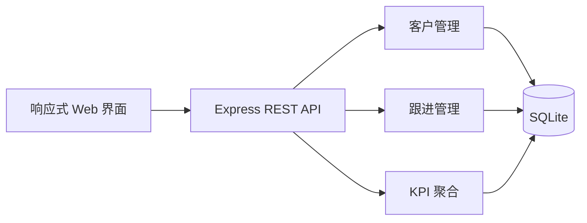

# CRM Sales Operations Demo

一个面向小型销售团队的轻量 CRM MVP，用一条清晰的业务链路连接客户资料、跟进记录与销售 KPI。项目采用 Node.js、Express 和 SQLite 构建，下载后即可在本地运行。

## 解决的问题

销售跟进常分散在表格、聊天记录和个人笔记中，团队难以统一查看客户状态，也无法快速统计销售人员的触达频次与服务覆盖。这个 Demo 将核心流程收敛为：

```text
客户建档 → 分配销售 → 记录跟进 → 沉淀历史 → 汇总 KPI
```

## 核心能力

- **客户管理**：记录公司、联系人、行业、来源和客户状态。
- **跟进闭环**：支持电话、线上会议、拜访、邮件等跟进类型，并记录结果与耗时。
- **历史追踪**：按客户查看完整跟进记录，减少信息断层。
- **销售 KPI**：统计跟进次数、客户覆盖数、总耗时及不同触达方式。
- **开箱即用**：首次启动自动创建 SQLite 表并写入少量演示数据。

## 产品与技术结构



项目刻意保持单文件应用结构，适合作为业务原型和需求验证 Demo；生产系统应进一步拆分前后端、补充权限与审计能力。

## 快速运行

要求 Node.js 20–25。

```bash
git clone https://github.com/PessimusS/crm-demo.git
cd crm-demo
npm install
npm start
```

浏览器访问 `http://localhost:3000`。数据库文件 `crm_demo.db` 会在首次启动时自动生成。

## API

| 方法 | 路径 | 用途 |
|---|---|---|
| `GET` | `/api/customers` | 查询客户列表 |
| `POST` | `/api/customers` | 新建客户 |
| `GET` | `/api/customers/:id` | 查询客户详情 |
| `GET` | `/api/customers/:id/followups` | 查询客户跟进记录 |
| `POST` | `/api/customers/:id/followups` | 新增跟进记录 |
| `GET` | `/api/users` | 查询销售人员 |
| `GET` | `/api/kpi/sales` | 销售人员 KPI |
| `GET` | `/api/kpi/customers` | 客户行业与来源统计 |
| `GET` | `/api/kpi/followups` | 跟进类型与结果统计 |

`/api/kpi/sales` 和 `/api/kpi/followups` 支持可选的 `start`、`end` 日期参数。

## 技术栈

| 层级 | 技术 |
|---|---|
| Web / API | Node.js、Express 5 |
| 数据存储 | SQLite、better-sqlite3 |
| 前端 | 原生 HTML、CSS、JavaScript |
| 数据交换 | REST、JSON |

## 项目结构

```text
crm-demo/
├── server.js          # API、数据库初始化与演示界面
├── package.json       # 项目命令与依赖
├── package-lock.json  # 锁定依赖版本
└── README.md
```

## 当前边界

- 当前为本地业务原型，未实现账号登录、角色权限和操作审计。
- 演示界面与服务端位于同一文件，便于快速验证，不代表生产架构。
- 示例数据仅用于体验流程，不应承载真实客户隐私信息。

## License

MIT
